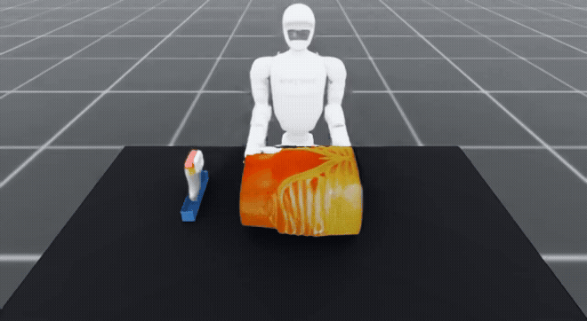
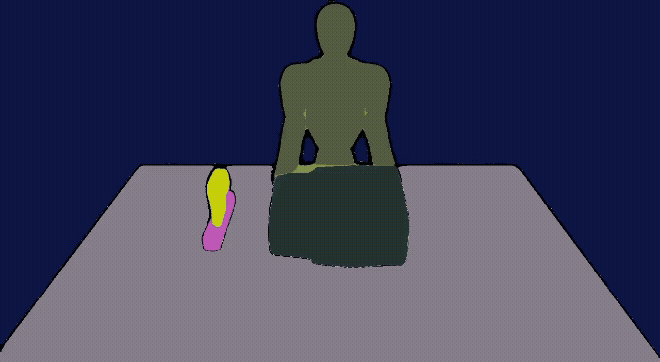
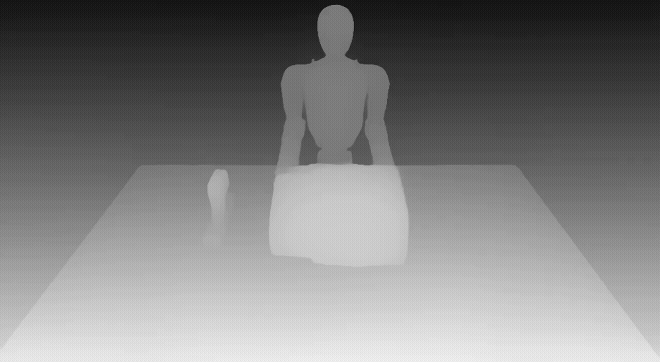
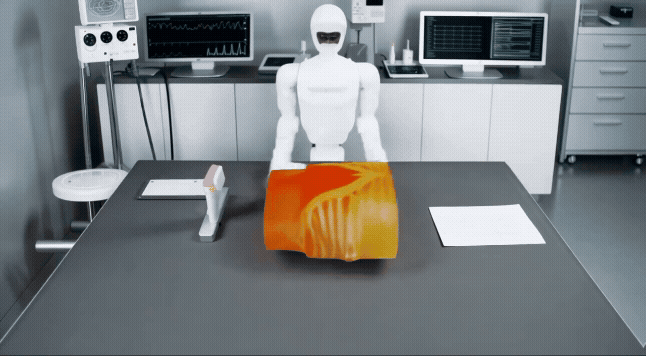

# Cosmos-transfer for Domain Randomization

This guide helps you use the [transfer_customized_input.py](../../../workflows/robotic_ultrasound/scripts/simulation/environments/cosmos_transfer1/transfer_customized_input.py) script to generate photorealistic videos from custom input videos using the Cosmos Transfer1 model. The script enables domain randomization by transferring simulation videos to realistic-looking footage while maintaining structural consistency through various control inputs.

## Overview

The `transfer_customized_input.py` script provides a flexible interface for:
- Converting simulation videos to photorealistic videos
- Supporting multiple control modalities (depth, segmentation, and edge)
- Guided generation with spatial-temporal masks
- Multi-GPU distributed inference

## Prerequisites

Before using the script, ensure you have:
1. **Cosmos Transfer1 model checkpoints**

    a. Download Cosmos Transfer1 checkpoints to checkpoint directory (Please follow the [instruction](../../../workflows/robotic_ultrasound/scripts/simulation/environments/cosmos_transfer1/README.md))

    b. Download additional SAM checkpoint
    ```bash
    wget https://dl.fbaipublicfiles.com/segment_anything/sam_vit_h_4b8939.pth -P checkpoints/
    ```
2. **GPU(s)** with sufficient VRAM (recommended: 48GB+ per GPU)
3. **Input video files** in a supported format (MP4, AVI, etc.)

## Quick Start

### Basic Usage

```bash
# Set environment variables
export CHECKPOINT_DIR="/path/to/cosmos-transfer1/checkpoints"
export PROJECT_ROOT="/path/to/i4h-workflows"
export PYTHONPATH="$PROJECT_ROOT/third_party/cosmos-transfer1:$PROJECT_ROOT/workflows/robotic_ultrasound/scripts"
cd workflows/robotic_ultrasound/scripts/simulation
# Run single video transfer
python -m environments.cosmos_transfer1.transfer_customized_input \
    --checkpoint_dir $CHECKPOINT_DIR \
    --controlnet_specs /path/to/controlnet_config.json \
    --video_save_folder outputs/ \
    --offload_text_encoder_model \
    --offload_guardrail_models
```

### Multi-GPU Usage

```bash
# Use torchrun for multi-GPU inference
torchrun --nproc_per_node=4 \
    -m environments.cosmos_transfer1.transfer_customized_input \
    --checkpoint_dir $CHECKPOINT_DIR \
    --controlnet_specs /path/to/controlnet_config.json \
    --video_save_folder outputs/ \
    --num_gpus 4 \
    --offload_text_encoder_model \
    --offload_guardrail_models
```

## Configuration

### ControlNet Specifications

The script requires a JSON configuration file that specifies which control modalities to use and their weights. if `input_control` is not provided, the corresponding condition will be generated automatically by SAM2 (seg) and DepthAnything (depth).  Here's an example configuration:

```json
{
    "prompt": "input prompt",
    "input_video_path": "input_video.mp4",
    "depth": {
        "control_weight": 0.5,
    },
    "seg": {
        "control_weight": 0.5,
    }
}
```

**Control Modalities:**
- `edge`: Edge detection control (Canny edges)
- `depth`: Depth map control
- `seg`: Segmentation mask control
- `control_weight`: Influence strength (0.0-1.0)

### Guided Generation (Advanced)

For precise control over specific regions:

```bash
python -m environments.cosmos_transfer1.transfer_customized_input \
    --checkpoint_dir $CHECKPOINT_DIR \
    --controlnet_specs /path/to/controlnet_config.json \
    --video_save_folder outputs/ \
    --sigma_max 80 \
    --x0_mask_path /path/to/mask.npz \
    --foreground_label "1,2" \
    --sigma_threshold 1.2866 \
    --offload_text_encoder_model \
    --offload_guardrail_models
```

- `--x0_mask_path`: Path to spatial mask file (.npz format)
- `--foreground_label`: Comma-separated mask labels to preserve
- `--sigma_max`: The level of partial noise added to the input video in the range [0, 80.0]. Any value equal or higher than 80.0 will result in not using the input video and providing the model with pure noise.
- `--sigma_threshold`: It has the same range of `sigma_max` and controls guidance steps (smaller = more guidance). The default value (1.2866) will perform 20 steps of guided generation.


## Example Workflows

### Multi-GPU Inference (Guided Generation) for Ultrasound Scanning using G1 Robot

The example [input CG video](https://developer.download.nvidia.com/assets/Clara/i4h/cosmos_tutorials/humanoid_input_video.mp4).



The example [input segmentation video](https://developer.download.nvidia.com/assets/Clara/i4h/cosmos_tutorials/seg_input_control.mp4).



The example [input depth video](https://developer.download.nvidia.com/assets/Clara/i4h/cosmos_tutorials/depth_input_control.mp4).



```bash
export CHECKPOINT_DIR="/path/to/cosmos-transfer1/checkpoints"
export PROJECT_ROOT="/path/to/i4h-workflows"
export PYTHONPATH="$PROJECT_ROOT/third_party/cosmos-transfer1:$PROJECT_ROOT/workflows/robotic_ultrasound/scripts"
# Download example npz mask for guided generation
wget https://developer.download.nvidia.com/assets/Clara/i4h/cosmos_tutorials/humanoid_masks.npz
# Use torchrun for multi-GPU inference
torchrun --nproc_per_node=4 \
    -m environments.cosmos_transfer1.transfer_customized_input \
    --checkpoint_dir $CHECKPOINT_DIR \
    --controlnet_specs environments/cosmos_transfer1/config/inference_cosmos_transfer1_g1_robot.json \
    --video_save_folder outputs_g1/ \
    --sigma_max 80 \
    --x0_mask_path humanoid_masks.npz \
    --foreground_label "1" \
    --num_gpus 4 \
    --offload_text_encoder_model \
    --offload_guardrail_models
```
The generated [output video](https://developer.download.nvidia.com/assets/Clara/i4h/cosmos_tutorials/output.mp4). We performed the guided generation for robot, human phantom, and scanning probe.



## Output Files

The script generates:
- **Video files**: `output.mp4` - Generated photorealistic videos
- **Prompt files**: `output.txt` - Used prompts for reproducibility
- **Control inputs**: Preprocessed depth/segmentation videos (if auto-generated)

### Command Line Arguments

| Argument | Type | Default | Description |
|----------|------|---------|-------------|
| `--prompt` | str | Default photorealistic prompt | Text prompt for video generation |
| `--negative_prompt` | str | Default negative prompt | What to avoid in generation |
| `--input_video_path` | str | "" | Path to input RGB video |
| `--controlnet_specs` | str | **Required** | Path to JSON controlnet configuration |
| `--video_save_folder` | str | "outputs/" | Output directory for generated videos |
| `--video_save_name` | str | "output" | Output filename (single video mode) |
| `--batch_input_path` | str | None | JSONL file for batch processing |
| `--num_input_frames` | int | 1 | Conditional frames |
| `--sigma_max` | float | 70.0 | Denoising strength |
| `--blur_strength` | str | "medium" | Blur level (very_low to very_high) |
| `--canny_threshold` | str | "medium" | Edge detection sensitivity |
| `--num_steps` | int | 35 | Diffusion sampling steps |
| `--guidance` | float | 5.0 | Classifier-free guidance scale |
| `--fps` | int | 24 | Output video framerate |
| `--height` | int | 704 | Output video height |
| `--width` | int | 1280 | Output video width |
| `--seed` | int | 1 | Random seed for reproducibility |
| `--num_gpus` | int | 1 | Number of GPUs for parallel inference |

### Memory Optimization Options

| Argument | Description |
|----------|-------------|
| `--offload_diffusion_transformer` | Offload DiT to save GPU memory |
| `--offload_text_encoder_model` | Offload text encoder after use |
| `--offload_guardrail_models` | Offload safety models |
| `--offload_prompt_upsampler` | Offload prompt upsampling model |
