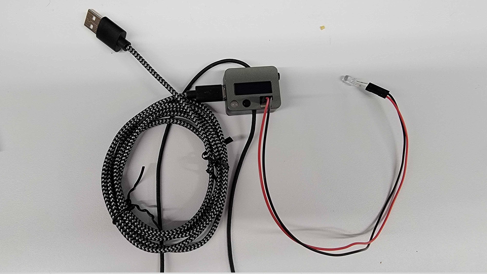
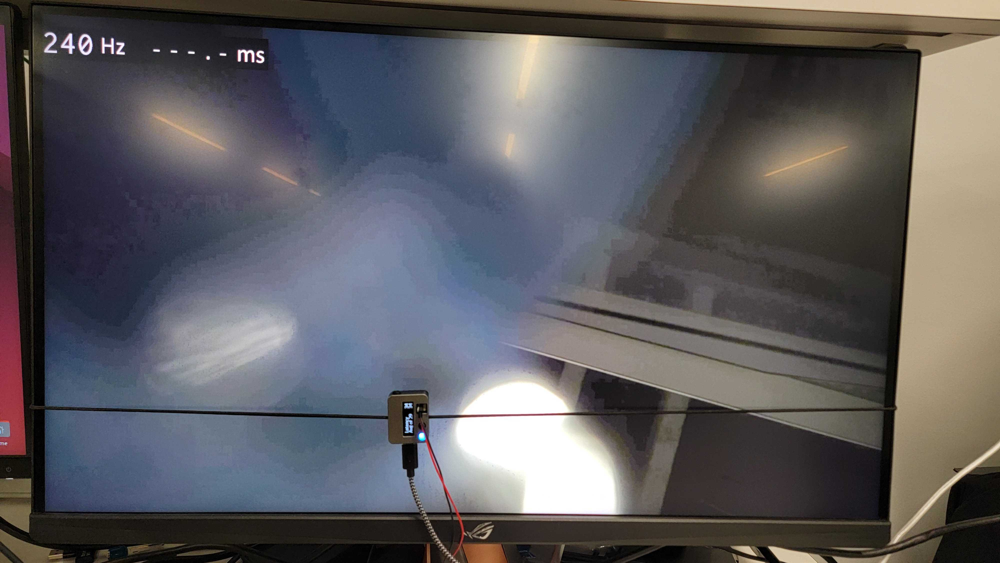
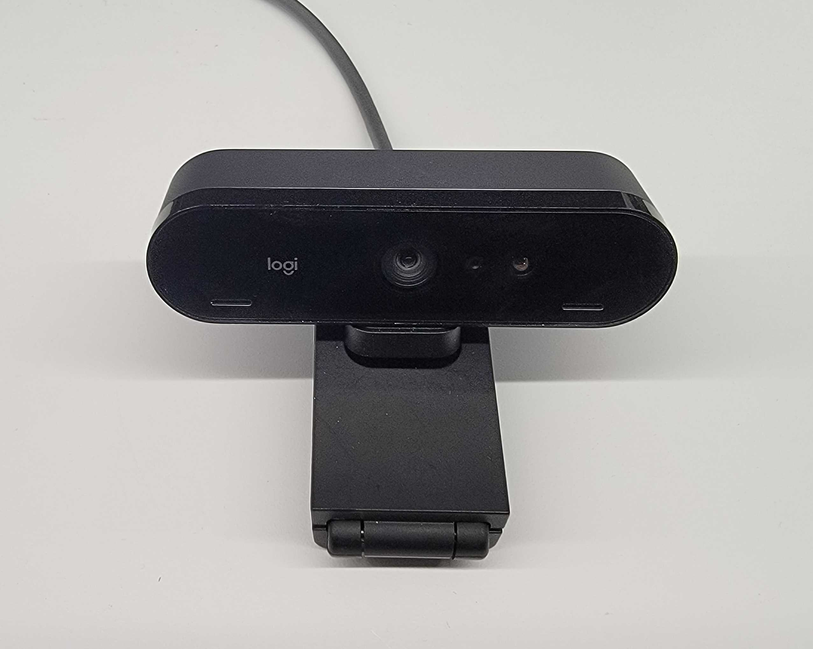
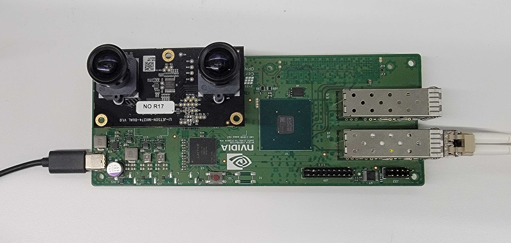
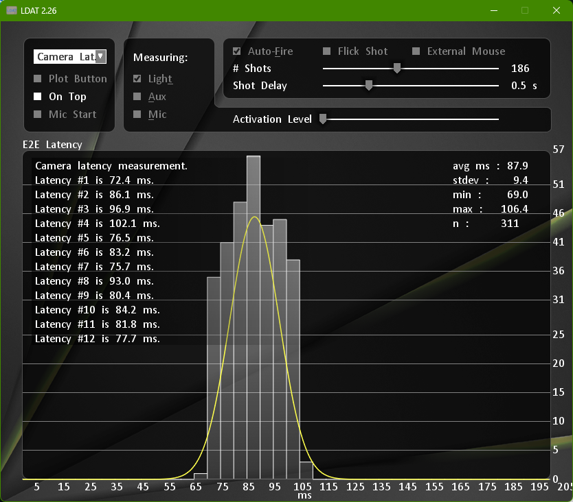
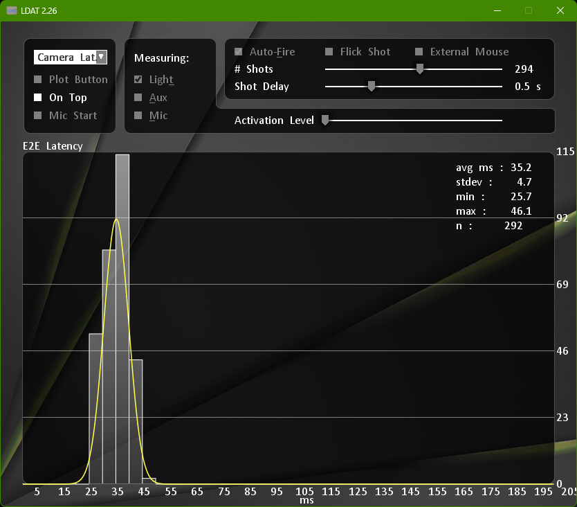

# Telesurgery Latency Benchmarking
<p align="center">

</p>

## Overview

This tutorial demonstrates how to measure end-to-end, photon-to-glass latency of the telesurgery video pipeline.  The measurement uses an NVIDIA Latency and Display Analysis Tool (LDAT), a controllable LED stimulus in the camera's field of view, and the LDAT luminance sensor positioned over the surgeon-side display. This setup captures the full pipeline, including <b>camera exposure, encode, transport, decode, render, and display response</b>.  For this setup, the patient and surgeon machines are expected to be located next to each other in order to perform the benchmarking with LDAT.

This tutorial assumes you already have a working [telesurgery workflow setup](https://github.com/isaac-for-healthcare/i4h-workflows/blob/main/workflows/telesurgery/README.md) either using a standard webcam or, for ultra-low latency, the <b>Holoscan Sensor Bridge (HSB) board</b> with IMX274 camera.

## Hardware Checklist

* <b>LDAT 5F</b> - Email vendor at nafis@ethercom.com to purchase the LDAT.
* <b>[LED](https://a.co/d/6dKhOqK)</b> - 3V LED
* <b>[2P Jumper Wire](https://a.co/d/4wwHn5I)</b> - Wire for connecting LDAT to LED.
* <b>[Micro-USB Cable](https://a.co/d/3d9HKAm)</b> - Cable for connecting LDAT to Windows machine.
* <b>Monitor</b> - A high refresh rate (240Hz+), [G-SYNC enabled Monitor](https://a.co/d/d858arn) is recommended for the surgeon's display for lowest latency and best picture quality.
* <b>Camera</b> - See [telesurgery workflow](https://github.com/isaac-for-healthcare/i4h-workflows/blob/main/workflows/telesurgery/README.md) for supported cameras.  This tutorial shows latency measurement using</br>
   1. [HSB](https://www.digikey.com/en/products/detail/lattice-semiconductor-corporation/LF-SNSR-ETH-EVN/25661892) with [IMX274 camera](https://leopardimaging.com/product/robotics-cameras/cis-2-mipi-modules/i-pex-mipi-camera-modules/rolling-shutter-mipi-cameras/8-49mp-imx274/li-imx274-mipi-d-holoscan-090h/), requires 2 [optical transceivers](https://a.co/d/fFKjpkg), 1 [fiber optic cable](https://a.co/d/fUiXyFi), and 1 SFP+ to QSFP+ [adapter](https://a.co/d/iitOM03) </br>
   2. [Logitech Brio 4K webcam](https://a.co/d/1Ye5Iob).
* <b>Windows PC/Laptop</b> - Windows machine used to run LDAT application.
* <b>Patient-side machine</b> - IGX devkit w/ dGPU. RTX Ampere 6000 or RTX ADA 6000 is recommended.
* <b>Surgeon-side machine</b> - IGX devkit w/ dGPU. RTX Ampere 6000 or RTX ADA 6000 is recommended.


## Setup

### LDAT



* Connect 2P jumper wire to 2-pin port on LDAT.  Ground is the outside pin.
* Connect LED to the jumper wire, short leg of LED connects to ground wire.
* Connect Micro-USB cable to LDAT.  The other end goes to USB port of Windows PC running the LDAT application.

### Monitor



For the G-SYNC enabled monitor with high refresh rate (240Hz+),

* Plug the monitor to the surgeon's IGX.
* Use the elastic band of the LDAT to attach it to the monitor.

### Camera

<p>
  
  
</p>

For cameras, we use the following setup
1. <b>Logitech Brio 4K webcam</b> - Connect the webcam to the patient's IGX via USB-C, or USB-C to USB-A.  Find the device with `v4l2-ctl` command.  In the output below, the video device corresponds to `/dev/video1` which we'll pass to `--device_idx` when launching the camera application.
```
➜  v4l2-ctl --list-devices
NVIDIA Tegra Video Input Device (platform:tegra-camrtc-ca):
	/dev/media0

vi-output, lt6911uxc 2-002b (platform:tegra-capture-vi:0):
	/dev/video0

Logitech BRIO (usb-3610000.usb-2):
	/dev/video1
	/dev/video2
	/dev/video3
	/dev/video4
	/dev/media1
```
2. <b>HSB w/ IMX274 camera</b> - This tutorial assumes you have experience using the HSB board, if not see the [HSB user guide](https://docs.nvidia.com/holoscan/sensor-bridge/latest/sensor_bridge_hardware_setup.html) on how to set this up.  For physical connections, you'll need to
* Connect IMX274 camera to HSB's MIPI port.
* Connect the HSB to the patient's IGX QSFP port via fiber optic cable with the required transceivers and adapter
* Connect USB-C port to power.
</br>You should be able to ping the HSB board from the patient's IGX.
```
➜ ping 192.168.0.2
PING 192.168.0.2 (192.168.0.2) 56(84) bytes of data.
64 bytes from 192.168.0.2: icmp_seq=1 ttl=64 time=0.225 ms
64 bytes from 192.168.0.2: icmp_seq=2 ttl=64 time=0.081 ms
...
```


### Windows Machine

Download [LDAT zip file](https://developer.nvidia.com/nvidia-latency-display-analysis-tool) and unzip the file to find the LDAT.exe application.

### Patient side

The patient's IGX should have 570+ drivers in order to use NVIDIA Video Codec, the default encoder for the telesurgery workflow.  Check which version you have by running `nvidia-smi`.  If it's below 570, follow the instructions [here](../../workflows/telesurgery/README.md#update-cuda-driver-on-igx) to update your nvidia driver.

Clone the i4h-workflows repo and build the docker image for the telesurgery real-world workflow.

```bash
export SURGEON_IP=<surgeon_ip>
export PATIENT_IP=<patient_ip>
export RTI_LICENSE_FILE=</path/to/license/file>

git clone git@github.com:isaac-for-healthcare/i4h-workflows.git
cd i4h-workflows
workflows/telesurgery/docker/real.sh build
workflows/telesurgery/docker/real.sh run
```

Now launch the camera application using either the IMX274 camera,
```bash
python patient/physical/camera.py --camera imx274
```
or with the webcam.  You may need to update _device_idx_ based on the output of `v4l2-ctl`.
```bash
python patient/physical/camera.py --camera cv2 --device_idx 1
```

### Surgeon side

On the surgeon's IGX, clone the i4h-workflows repo and build the docker image for the telesurgery real-world workflow.

```bash
export SURGEON_IP=<surgeon_ip>
export PATIENT_IP=<patient_ip>
export RTI_LICENSE_FILE=</path/to/license/file>

git clone git@github.com:isaac-for-healthcare/i4h-workflows.git
cd i4h-workflows
workflows/telesurgery/docker/real.sh build
```

Now launch the surgeon's viewer application in fullscreen mode to minimize latency. For the lowest possible latency, [use exclusive display](https://docs.nvidia.com/holoscan/sdk-user-guide/visualization.html#using-a-display-in-exclusive-mod) mode, which allows the GPU to render directly to the display.

```
workflows/telesurgery/docker/real.sh run
python surgeon/viewer.py --fullscreen
```
If running on HSB w/ IMX274, you should also pass `--srgb` option to apply gamma correction.
```
workflows/telesurgery/docker/real.sh run
python surgeon/viewer.py --fullscreen --srgb
```

At this point, you should see the video feed from the patient's camera on the surgeon's display.

## Measuring Latency

Now that everything is set up, we can measure system latency of the telesurgery workflow.

1. Make sure the LED is visible in the camera’s field of view.
2. Position the LDAT on the surgeon’s monitor so it aligns with the LED.
3. On your Windows laptop:
   * Launch <b>LDAT.exe</b>
   * Select <b>Camera Latency</b> and confirm when prompted
   * Adjust the <b># Shots</b> setting using the slider
   * Click <b>Auto-Fire</b>

The images below show the photon-to-glass latency for the Logitech Brio 4K webcam running at 1080p at 30fps (left), and the HSB board w/ IMX274 camera running at 1080p at 60fps (right) using the telesurgery workflow.

<p>
  
  
</p>
